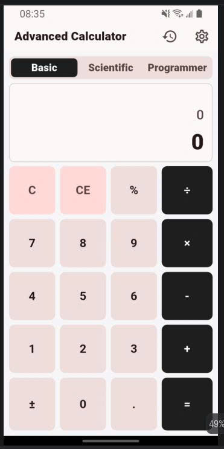
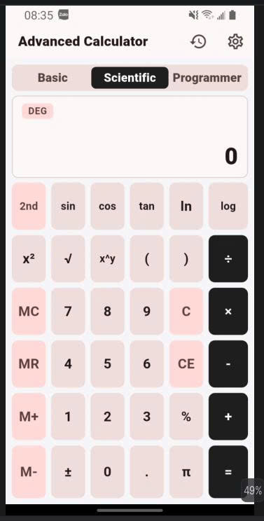
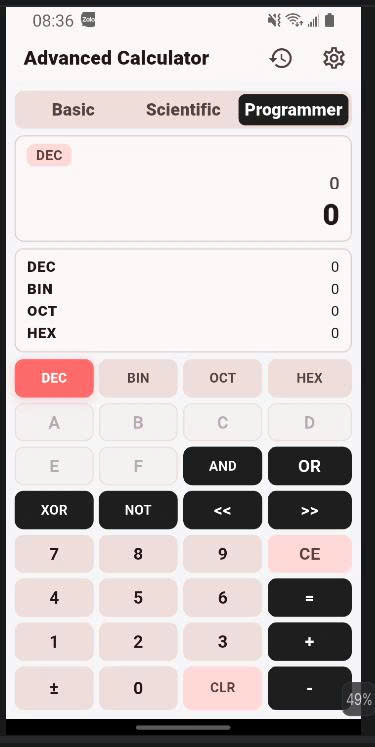
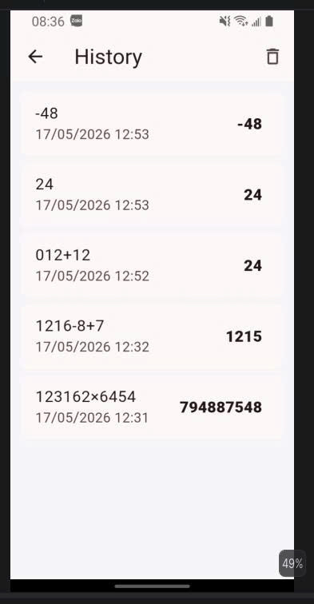
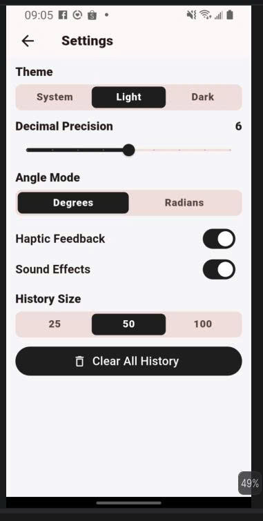
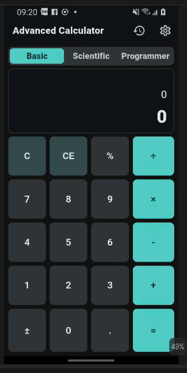
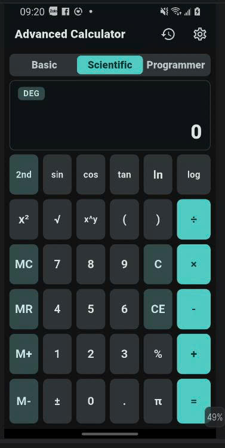
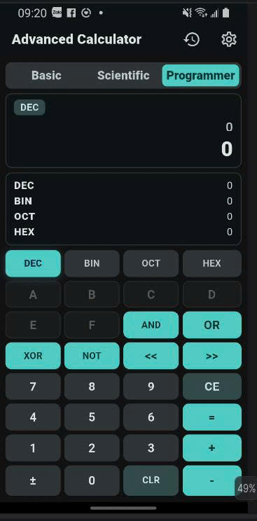
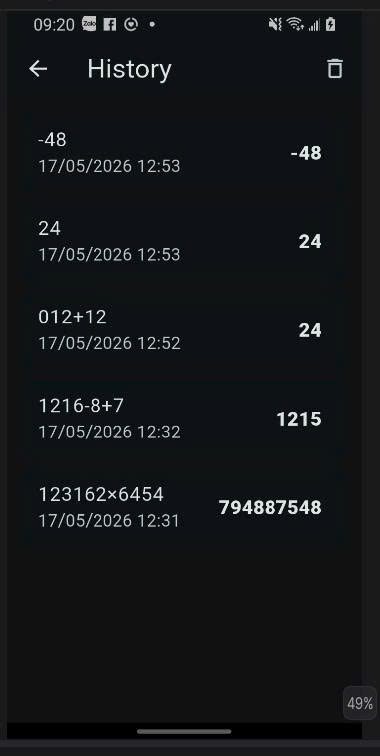
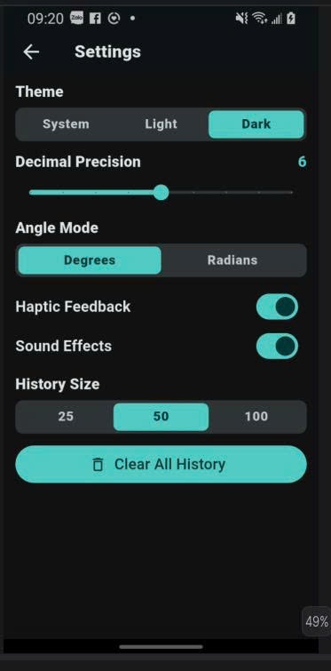

# Advanced Calculator

Advanced Calculator là ứng dụng máy tính nâng cao được xây dựng bằng Flutter. Ứng dụng hỗ trợ 3 chế độ tính toán: **Basic**, **Scientific** và **Programmer**. Project sử dụng **Provider** để quản lý trạng thái, đồng thời lưu lịch sử tính toán, theme và settings bằng **SharedPreferences**.

## Công Nghệ Sử Dụng

- Flutter
- Dart
- Provider
- SharedPreferences
- math_expressions
- intl
- flutter_test

## Chức Năng Chính

- **Basic Calculator**: cộng, trừ, nhân, chia, phần trăm, đổi dấu, số thập phân, C và CE.
- **Scientific Calculator**: sin, cos, tan, ln, log, x², căn, lũy thừa, π, e, DEG/RAD và các hàm khoa học mở rộng.
- **Programmer Calculator**: chuyển đổi DEC, BIN, OCT, HEX; hỗ trợ AND, OR, XOR, NOT, <<, >>.
- **Calculation History**: lưu lịch sử tính toán, xem lại kết quả cũ và chọn lại phép tính từ lịch sử.
- **Settings**: chọn theme, độ chính xác thập phân, DEG/RAD, history size, haptic feedback và sound effects.
- **Memory Functions**: MC, MR, M+, M-.
- **Theme**: hỗ trợ Light, Dark và System theme.
- **Error Handling**: xử lý lỗi chia cho 0, biểu thức sai, căn số âm và các lỗi tính toán thường gặp.

## Screenshots

### Basic Mode - Light Theme



### Scientific Mode - Light Theme



### Programmer Mode - Light Theme



### History Screen - Light Theme



### Settings Screen - Light Theme



### Basic Mode - Dark Theme



### Scientific Mode - Dark Theme



### Programmer Mode - Dark Theme



### History Screen - Dark Theme



### Settings Screen - Dark Theme



## Cấu Trúc Thư Mục

```text
lib/
  main.dart
  models/
  providers/
  screens/
  widgets/
  utils/
  services/
test/
docs/
screenshots/
```

- `models/`: chứa các model dữ liệu như lịch sử tính toán, settings, mode.
- `providers/`: quản lý state của calculator, history và theme.
- `screens/`: chứa các màn hình chính như Calculator, History, Settings.
- `widgets/`: chứa các widget tái sử dụng như display, button grid, calculator button.
- `utils/`: chứa logic tính toán, expression parser và constants.
- `services/`: xử lý lưu dữ liệu local bằng SharedPreferences.
- `test/`: chứa unit test và widget test.
- `docs/`: tài liệu kiến trúc và kiểm thử.
- `screenshots/`: thư mục đặt ảnh demo để hiển thị trong README.

## Kiến Trúc App

App sử dụng **Provider** để quản lý trạng thái và tự động cập nhật UI khi dữ liệu thay đổi.

- `CalculatorProvider`: quản lý expression, result, calculator mode, memory, angle mode và programmer base.
- `HistoryProvider`: quản lý danh sách lịch sử tính toán, giới hạn số lượng lịch sử và lưu/xóa history.
- `ThemeProvider`: quản lý Light/Dark/System theme.
- `StorageService`: lưu settings, theme và history bằng SharedPreferences.

Luồng xử lý chính:

```text
User Input
   ↓
Calculator Button
   ↓
CalculatorProvider
   ↓
Calculator Logic / Expression Parser
   ↓
Update Result + Save History
   ↓
UI Rebuild with Provider
```

## Cài Đặt Project

```bash
git clone <repository-url>
cd advanced_calculator
flutter pub get
flutter run
```

Nếu chạy trực tiếp trong thư mục project hiện tại:

```bash
flutter pub get
flutter run
```

## Chạy Test

```bash
flutter test
```

## Kiểm Tra Chất Lượng Code

```bash
flutter analyze
```

## Dữ Liệu Được Lưu Cục Bộ

Ứng dụng sử dụng SharedPreferences để lưu:

- Lịch sử tính toán.
- Lựa chọn theme.
- Cài đặt độ chính xác thập phân.
- DEG/RAD mode.
- History size.
- Haptic feedback và sound effects setting.
